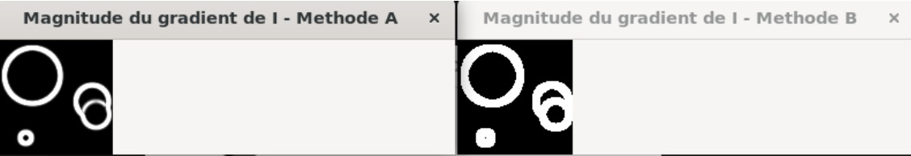

# [Exercice 1 : La transformé de Hough pour les cercles]{.ul}

1.  $r\  \in \left\lbrack 1,100 \right\rbrack\ avec\ \delta r = 2\ $
   Nous avons donc 100 valeurs de r espacé d'un pas de 2, ce qui fait que
   nous pouvons avoir $\frac{100}{2} = 50$ valeurs discrètes.\
   Si $r\  \in \left\lbrack 1,100 \right\rbrack\ avec\ \delta r = 0.5$, nous avons donc toujours 100 valeurs de r espacé d'un pas de 0.5, ce qui
   fait que nous pouvons avoir $\frac{100}{0.5} = 200$ valeurs discrètes.

2. Reponse

3. Nous avons $r \in \left\lbrack 1,100 \right\rbrack\ ;c \in \left\lbrack 1,100 \right\rbrack\ ;rad \in \left\lbrack 5,100\sqrt{2} \right\rbrack$ \
   Donc Acc(1,1,1), où (1,1,1) est la 1^er^ valeur discrète de r,c,rad, est
   un cercle de centre (x,y) = (1,1) et de rayon 5 pixel.\
   Acc(10,7,30) est un cercle de centre (x,y) = (10,7) et de rayon 30,
   c'est un cercle qui à son centre dans l'image mais qui dépasse de
   l'image si on considère que le repère est en (0,0) dans l'angle en haut
   à gauche.

4. Le cercle de centre (x,y) = (40,40) qui est donc la 40eme valeurs
   discrète de x et de y, et de rayon rad = 13 qui est la 13eme valeur
   discrète de rad est dans l'accumulateur a la position Acc(40,40,13).

# [Exercice 2 : Implémentation du détecteur]{.ul}

Dans cette deuxième partie du tp, nous allons implémenter nous même une
fonction permettant la détection de cercle. Une telle fonction dans
OpenCV est déjà existant mais dans cette partie nous ne l'utilisera pas
sauf pour faire une comparaison avec notre résultat final.

Pour effectuer cette implémentation, nous allons devoir passer par
plusieurs étapes que nous allons décrire ci-dessous.

## Filtrage Gaussien 

Dans un premier temps, nous allons faire passer l'image chargé par un
filtre gaussien. Afin de simplifier cette étape nous utiliserons une
fonction déjà présente dans OpenCV : « cv::GaussianBlur »

Cette fonction prend en paramètre :

-   L'image source, ici notre image avec les cercles

-   Une matrice de retour (output)

-   Une taille qui donne la zone sur laquelle le filtre gaussien
    s'applique, nous avons choisi une matrice de 5x5 pixel autour

-   La méthode d'extrapolation que l'on laisse par défaut dans notre
    cas (0)

Ce filtre gaussien nous permet de réduire grandement le bruit contenu
dans l'image en lissant les pixels sans détruire les informations. Cela
nous permettra par la suite une meilleure détection des pixels de
contour et donc des cercles.

## Filtrage de Sobel 

Après l'application de ce filtre gaussien qui est optionnel, nous
appliquerons un filtre de Sobel. Le filtre de Sobel nous permettra

De la même manière nous utiliserons une fonction déjà présente dans
OpenCV : « cv::Sobel »

Cette fonction prend en paramètre :

-   L'image source

-   Une matrice de sortie

-   La profondeur de l'image : CV_64F

-   1

-   0

Nous l'appliquerons d'abords sur X puis une seconde fois sur Y pour à la
suite les combiner ensemble.

## Recherche des cercles par transformé de Hough 

Une fois les traitements pour améliorer l'image, nous allons pouvoir
effectuer la recherche des cercles. Afin de la simplifier, nous allons
d'abord passer l'image en noir et blanc.

### Calcul de la magnitude 

Dans un premier temps nous allons calculer les produits de convolution.
Pour cela nous utiliserons une fonction d'OpenCV : ```cv::filter2D```.
Nous en calculerons 6.

Ces produits de convolutions nous permettrons de calculer la magnitude.
Nous avons implémenté 2 méthode différente pour calculer la magnitude.
La méthode A est juste une fonction additionnant les produits de
convolution, la méthode B quant à elle utilise une fonction d'OpenCV :
```cv::magnitude```

La méthode A nous donnant de meilleur résultat pour la suite de notre
implémentation, c'est celle la que l'on utilisera. En effet, on
remarquera que les cercles de la méthode A sont plus « fin » que celle
de la méthode B.

{width="6.3in" height="1.0791666666666666in"}

Grâce aux calcule de la magnitude, nous obtenons clairement nos pixels
de contour. Nous avons nos pixels de contour (du cercle) qui sont a 255
et le reste des pixels à 0.

### Sélection des contours 

Afin d'affiner la magnitude, nous allons réaliser une sélection plus
fine des contours. Pour cela nous reprenons la magnitude du gradient et
nous allons passer les pixels de contour à 255 et les autres pixels à 0

### Création et itération de l'accumulateur 

Nous allons par la suite créer une matrice 3D que l'on appelle
accumulateur. Cet accumulateur est de la taille de l'image et
l'intervalle de rayon que l'on à déterminer, c'est-à-dire dans notre cas
avec four.png de $100\times100\times(rmax - rmin)$. Il est initialisé à 0.

Nous allons par la suite parcourir l'image pixel par pixel et lorsque
nous sommes sur un pixel de contour (pixel à 255) déterminé juste avant,
nous allons calculer tous les centre possible que ce pixel peut avoir
pour faire partie d'un cercle et incrémenté la case r de la coordonnée
(x,y,r) de 1/r.

Nous incrémenterons la case de 1/r afin d'avoir un poids sur les cercles
et ainsi trouver tous les cercles, qu'ils soient petits ou grands. Si
nous ne le faisions pas ainsi, le risque est de ne pas trouver les
petits cercles et que des courbes dans l'image qui ne sont pas des
cercles soient aussi détectés.

### Calcul des maxima locaux 

Une fois que l'accumulateur est entièrement rempli, nous allons regarder
les maximas locaux afin de vérifier que les valeurs que nous avons
correspondent bien à un centre de cercle. Pour cela nous allons
parcourir notre accumulateur en x,y et z. Nous vérifierons que dans les
26 cases autour (27 cases -- celle où nous sommes), il n'y a pas de
valeurs plus grandes. Si c'est le cas alors notre point n'est pas le
centre, si ce n'est pas le cas nous avons trouvé le centre de notre
cercle. Nous mettons les cercles trouvés dans un vecteur qui nous
servira pour les afficher.

### Affichage des cercles 

Afin de vérifier que nous avons le bon résultat et de visualiser les
cercles que nous avons trouvés, nous allons les afficher dans une
fenêtre.

Pour cela nous allons parcourir notre vecteur cercle créer précédemment
et nous allons utiliser la fonction d'OpenCV : ```cv::circle()``` qui nous
permettra de les tracer sur une image.

Il nous reste plus qu'a afficher l'image et nous pouvons observer nos
cercles.


# [Exercice 3 : Temps de calcul]{.ul} 

1. En effet, l'algorithme est au minimum de l'ordre N^4^ car lors du
   parcours de l'accumulateur pour les maximums locaux nous parcourons
   4 boucles for imbriqué. Le temps d'exécution du reste du programme
   est peut important car très inferieur à ce temps de parcours.
   Avec un N proche de 600, nous aurions :
   $$O\left( 600 \right) = 600^{4} = \ 129\, 600\, 000\, 000$$
   Soit un temps d'exécution très long.
   Exemple de différence entre deux images de tailles différentes


2. Pour résoudre ce problème de compléxité, nous avons deux méthodes d'optimisation possible : 

   1. l'utilisation de la direction du gradient obtenu à partir du filtre de Sobel
   2. l'utilisation d'une représentation pyramidale de l'image, consistant à réduire la taille de l'image par deux. 

   Dans notre cas, nous avons opté pour la solution 2, cependant, nous l'avons légèrement modifié. En effet, pour optimiser les images au-dessus d'une résolution de $300 \times 300$ (stade où le traitement commence à être long), nous réduisons la taille de notre image originale de la moitié de sa taille. Pour cela, nous utilisons la fonction ```cv::resize()```. Une fois, l'image réduit, nous réalisons la detection de cercle par la transformé de Hough. Une fois cette detection réalisé, nous ré-augmentons la taille de l'image de 2 fois ça taille, pour ré-obtenir sa taille d'origine. 
   Voici les résultats pour l'image ```coins2.jpg```

   


Nous constatons ici que nous sommes passé d'un temps de traitement de $43403 \text{ ms}$ à un temps de $5518 \text{ ms}$, soit un temps d'exécution divisé par environ $8$. 
